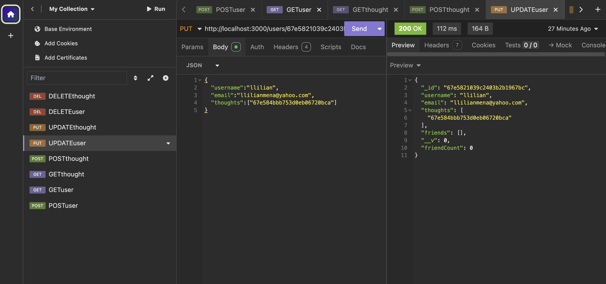

# Social Network API





## Description
This is a backend API for a social network application that allows users to share their thoughts, react to friends' thoughts, and manage their friend list. It is built using Node.js, Express.js, and MongoDB with Mongoose.

## Installation
1. Clone the repository:
   ```sh
   git clone <repository-url>
   ```
2. Navigate into the project directory:
   ```sh
   cd social-network-api
   ```
3. Install dependencies:
   ```sh
   npm install
   ```
4. Start the server:
   ```sh
   node index.js
   ```

## Usage
- Use **Insomnia** to test API routes.
- Ensure MongoDB is running locally or provide a connection string to a remote database.

## Acceptance Criteria

- **GIVEN** a social network API
- **WHEN** I enter the command to invoke the application
  - **THEN** my server is started and the Mongoose models are synced to the MongoDB database
- **WHEN** I open API GET routes in Insomnia for users and thoughts
  - **THEN** the data for each of these routes is displayed in a formatted JSON
- **WHEN** I test API POST, PUT, and DELETE routes in Insomnia
  - **THEN** I am able to successfully create, update, and delete users and thoughts in my database
- **WHEN** I test API POST and DELETE routes in Insomnia
  - **THEN** I am able to successfully create and delete reactions to thoughts and add and remove friends to a user’s friend list

## API Routes
### Users
- `GET /api/users` - Get all users
- `GET /api/users/:id` - Get a single user by ID
- `POST /api/users` - Create a new user
- `PUT /api/users/:id` - Update a user by ID
- `DELETE /api/users/:id` - Delete a user by ID
- `POST /api/users/:userId/friends/:friendId` - Add a friend
- `DELETE /api/users/:userId/friends/:friendId` - Remove a friend

### Thoughts
- `GET /api/thoughts` - Get all thoughts
- `GET /api/thoughts/:id` - Get a single thought by ID
- `POST /api/thoughts` - Create a new thought
- `PUT /api/thoughts/:id` - Update a thought by ID
- `DELETE /api/thoughts/:id` - Delete a thought by ID
- `POST /api/thoughts/:thoughtId/reactions` - Add a reaction to a thought
- `DELETE /api/thoughts/:thoughtId/reactions/:reactionId` - Remove a reaction from a thought

## Technologies Used
- Node.js
- Express.js
- MongoDB
- Mongoose

## Contact
For any inquiries, please reach out to the project owner.

